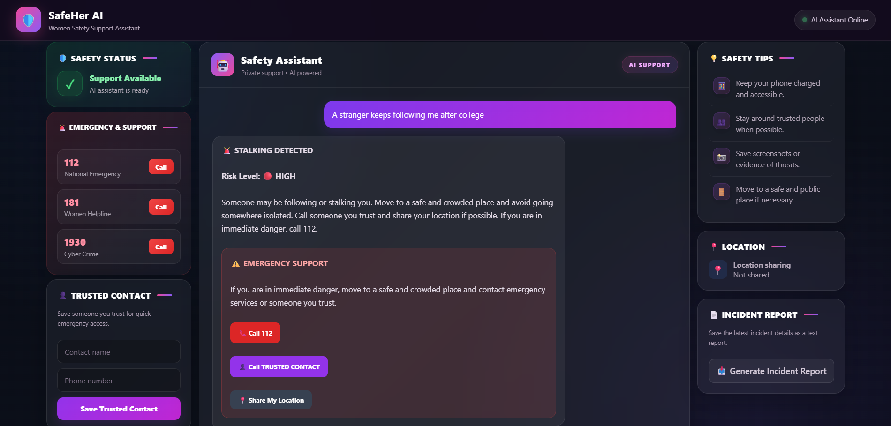

# 🛡️ Women Safety Support Chatbot

An AI-powered women safety support chatbot built using **Python, Natural Language Processing (NLP), Machine Learning, and Flask**.

The chatbot analyzes a user's message and classifies it into different safety-related categories. Based on the detected category, it provides an appropriate safety response and risk level.

---

## 📌 Project Overview

The Women Safety Support Chatbot is designed to provide quick initial support when a user describes a potentially unsafe situation.

The system uses a Machine Learning text classification model to understand the user's message and classify it into one of seven categories:

- Stalking
- Online Threat
- Domestic Violence
- Harassment
- Physical Danger
- Emergency Help
- General Support

The chatbot then generates a category-specific response containing safety guidance.

> ⚠️ This project is intended as an educational/support system and should not replace emergency services or professional assistance.

---

## 🌐 Live Demo

You can try the deployed chatbot here:

**[Open Women Safety Support Chatbot](https://women-safety-support-chatbot.onrender.com)**

## 📸 Demo



## ✨ Features

- 🤖 Machine Learning based text classification
- 💬 Natural Language Processing for user messages
- 🚨 Seven safety-related categories
- 🔴 Risk-level based responses
- 🌐 Flask web application
- 🇬🇧 English and Hinglish-style input support
- 📞 Emergency support information
- 📍 Location-sharing support in the web interface
- 📊 Model evaluation using accuracy, precision, recall and F1-score
- 🧪 Separate test dataset for evaluation

---

## 🛠️ Tech Stack

### Programming Language
- **Python**

### Backend
- **Flask** — Web application framework

### Machine Learning & NLP
- **Scikit-learn** — Machine Learning algorithms
- **TF-IDF** — Text feature extraction
- **N-grams** — Unigram and bigram text features
- **Logistic Regression** — Text classification

### Frontend
- **HTML**
- **CSS**
- **JavaScript**

### Deployment
- **Render** — Cloud deployment
- **Gunicorn** — Production WSGI server

### Version Control
- **Git**
- **GitHub**


## ⚙️ Installation

### 1. Clone the repository

    git clone https://github.com/Prince-9654/Women_Safety_Chatbot.git
    cd Women_Safety_Chatbot

### 2. Install required dependencies

    pip install -r requirements.txt

### 3. Run the application

    python app.py

### 4. Open the chatbot

After the Flask server starts, open your browser and visit:

    http://127.0.0.1:5000

### 5. Stop the application

To stop the Flask server, press:

    Ctrl + C

---

## 📁 Project Structure

```text
Women_Safety_Chatbot/
│
├── app.py
├── chatbot.py
├── requirements.txt
├── README.md
├── .gitignore
│
├── templates/
│   └── index.html
│
└── screenshots/
    └── chatbot-demo.png
```

## 🧠 Machine Learning Model

The project uses:

- **TF-IDF (Term Frequency-Inverse Document Frequency)** for converting text into numerical features
- **N-gram features** with unigram and bigram support
- **Logistic Regression** for text classification

### Supported Categories

The model classifies user messages into the following safety-related categories:

- Domestic Violence
- Emergency Help
- General Support
- Harassment
- Online Threat
- Physical Danger
- Stalking

### Machine Learning Pipeline

```text
User Message
     ↓
Text Input
     ↓
TF-IDF Vectorization
     ↓
Logistic Regression
     ↓
Category Prediction
     ↓
Risk Level
     ↓
Safety Response
```

---

## 📊 Model Performance

The chatbot uses a machine learning-based text classification model to identify different types of safety-related situations.

### Test Accuracy

**96.43%**

### Classification Report

| Category | Precision | Recall | F1-Score |
|---|---:|---:|---:|
| Domestic Violence | 1.00 | 1.00 | 1.00 |
| Emergency Help | 1.00 | 0.75 | 0.86 |
| General Support | 0.80 | 1.00 | 0.89 |
| Harassment | 1.00 | 1.00 | 1.00 |
| Online Threat | 1.00 | 1.00 | 1.00 |
| Physical Danger | 1.00 | 1.00 | 1.00 |
| Stalking | 1.00 | 1.00 | 1.00 |

The model was evaluated on a separate test dataset containing **28 test samples**.
